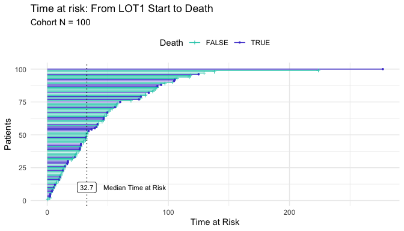
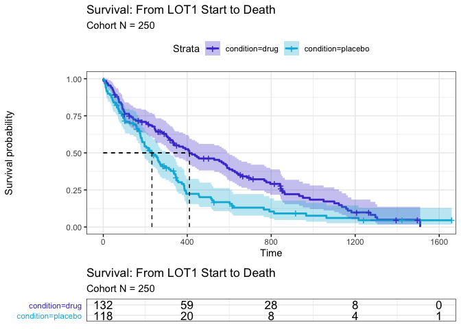

<!-- README.md is generated from README.Rmd. Please edit that file -->

# iwillsurvive 0.1.0 

[](https://www.tidyverse.org/lifecycle/#experimental)
[](https://en.wikipedia.org/wiki/Gloria_Gaynor)

The goal of `iwillsurvive` is to make it easy to fit and visualize
simple survival models. It provides wrapper functions around commonly
used functions from survival packages such as `survival::survfit()` and
`survminer::ggsurvplot()`, while providing user-friendly in-line
messages, notes, and warnings.

## Installation

`iwillsurvive` is hosted at
<https://github.com/ndphillips/iwillsurvive>. Here is how to install it:

``` r
devtools::install_github(repo = "https://github.com/ndphillips/iwillsurvive",
                         build_vignettes = TRUE)
```

## Example

``` r
library(iwillsurvive)
#> -----------------------------------------------------------------------
#> iwillsurvive 0.1.0 'Gloria'
#> Intro   : vignette('introduction', 'iwillsurvive')
#> Repo    : https://github.com/ndphillips/iwillsurvive
#> .......................................................................
library(dplyr)
#> 
#> Attaching package: 'dplyr'
#> The following objects are masked from 'package:stats':
#> 
#>     filter, lag
#> The following objects are masked from 'package:base':
#> 
#>     intersect, setdiff, setequal, union
```

It’s best to start with one-row-per-patient (ORPP) cohort object that
contains columns corresponding to

-   `patientid`, a unique patient identifier
-   `index_date`, a date corresponding to an index date.
-   `censor_date`, date corresponding to when patients were censored
-   `event_date`, date corresponding to the event of interest. NA values
    indicate that the event was not observed.

`iwillsurvive` provides one such example in `ez_cohort`, a dataframe of
simulated patients:

``` r
ez_cohort
#> # A tibble: 100 x 5
#>    patientid group   lotstartdate censordate dateofdeath
#>    <chr>     <chr>   <date>       <date>     <date>     
#>  1 F00001    placebo 2020-07-20   2020-09-15 NA         
#>  2 F00002    drug    2020-04-21   2020-07-27 NA         
#>  3 F00003    drug    2020-07-24   NA         2020-08-09 
#>  4 F00004    placebo 2020-01-04   2020-08-14 NA         
#>  5 F00005    placebo 2020-04-07   2020-08-22 NA         
#>  6 F00006    drug    2020-01-07   2020-04-23 NA         
#>  7 F00007    drug    2020-07-01   NA         2020-07-10 
#>  8 F00008    placebo 2020-10-25   NA         2020-11-30 
#>  9 F00009    placebo 2020-05-25   2020-06-20 NA         
#> 10 F00010    placebo 2020-10-07   2020-11-07 NA         
#> # … with 90 more rows
```

Use the `derive_*()` functions to calculate key derived columns:

-   `follow_up_date` - `dateofdeath`, if known, and `censordate`,
    otherwise
-   `follow_up_days` - Days from `index_date` (in our case,
    `lotstartdate`) to `follow_up_date`
-   `event_status` - A logical column indicating whether or not the
    event (`dateofdeath`) is known.

``` r
cohort <- ez_cohort %>%
  
  derive_follow_up_date(event_date = "dateofdeath",
                        censor_date = "censordate") %>%
  
  derive_follow_up_time(index_date = "lotstartdate") %>%
  
  derive_event_status(event_date = "dateofdeath")
```

Here is our updated cohort object (moving our derived columns to the
front) for visibility

``` r
cohort %>%
  select(patientid, follow_up_date, follow_up_days, event_status, 
         everything())
#> # A tibble: 100 x 8
#>    patientid follow_up_date follow_up_days event_status group lotstartdate
#>    <chr>     <date>                  <dbl> <lgl>        <chr> <date>      
#>  1 F00001    2020-09-15              57.1  FALSE        plac… 2020-07-20  
#>  2 F00002    2020-07-27              97.1  FALSE        drug  2020-04-21  
#>  3 F00003    2020-08-09              16.5  TRUE         drug  2020-07-24  
#>  4 F00004    2020-08-14             224.   FALSE        plac… 2020-01-04  
#>  5 F00005    2020-08-22             138.   FALSE        plac… 2020-04-07  
#>  6 F00006    2020-04-23             107.   FALSE        drug  2020-01-07  
#>  7 F00007    2020-07-10               9.87 TRUE         drug  2020-07-01  
#>  8 F00008    2020-11-30              36.6  TRUE         plac… 2020-10-25  
#>  9 F00009    2020-06-20              26.4  FALSE        plac… 2020-05-25  
#> 10 F00010    2020-11-07              31.7  FALSE        plac… 2020-10-07  
#> # … with 90 more rows, and 2 more variables: censordate <date>,
#> #   dateofdeath <date>
```

Use `plot_follow_up_time()` to visualize the time at risk data

``` r
plot_follow_up_time(cohort, 
                    follow_up_time = "follow_up_days", 
                    event_name = "Death", 
                    index_name = "LOT1 Start")
```



Use `fit_survival()` to fit the survival model. We’ll set the follow up
time to be `follow_up_days` and specify “group” as a term (i.e.;
covariate) to be used in the model

<!-- If we were using `survival::survfit()` we'd need to specify this nasty 
looking formula `survival::survfit(survival::Surv(follow_up_days, event_status, 
type = 'right') ~ group, data = cohort)` directly.  -->
<!-- With `fit_survival()`, we can simply specify the column names of interest 
and let the function take care of the formula: -->

``` r
cohort_fit <- fit_survival(cohort, 
                           follow_up_time = "follow_up_days", 
                           terms = "group")
#> ── fit_survival ────────────────────────────────────────────────────────────────
#> - survival::survfit(survival::Surv(follow_up_days, event_status, type = 'right') ~ group, data = cohort)
#> - 39 of 100 (39%) patient(s) experienced the event.
```

The result is a `survfit` object (from the `survival` package)

``` r
class(cohort_fit)
#> [1] "survfit"

cohort_fit
#> Call: survfit(formula = survival::Surv(follow_up_days, event_status, 
#>     type = "right") ~ group, data = cohort)
#> 
#>                n events median 0.95LCL 0.95UCL
#> group=drug    47     20   83.8    55.9      NA
#> group=placebo 53     19   91.0    46.5      NA
```

Use `plot_survival()` to plot the result. Use the `index_name` and
`event_name` to give descriptive names to the key events:

``` r
plot_survival(cohort_fit, 
              cohort = cohort, 
              index_name = "LOT1 Start", 
              event_name = "Death")
#> Warning: Vectorized input to `element_text()` is not officially supported.
#> Results may be unexpected or may change in future versions of ggplot2.
```


