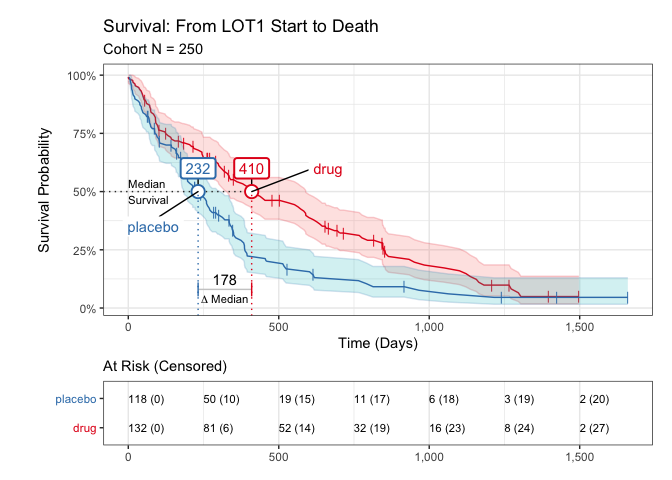

<!-- README.md is generated from README.Rmd. Please edit that file -->

# iwillsurvive 0.1.4 

[](https://www.tidyverse.org/lifecycle/#experimental)
[](https://en.wikipedia.org/wiki/Gloria_Gaynor)

The goal of `iwillsurvive` is to make it easy to fit and visualize
simple survival models. It does this by providing an intuitive
functional interface and user-friendly in-line messages, notes, and
warnings, while leveraging the gold-standard `survival` package for all
statistical methods.

## Installation

`iwillsurvive` is hosted at
<https://github.com/ndphillips/iwillsurvive>. Here is how to install it:

``` r
devtools::install_github(repo = "https://github.com/ndphillips/iwillsurvive",
                         build_vignettes = TRUE)
```

## Example

``` r
library(iwillsurvive)
#> -----------------------------------------------------
#> iwillsurvive 0.1.4 'Gloria'
#> Intro  : vignette('introduction', 'iwillsurvive')
#> Repo   : https://github.com/ndphillips/iwillsurvive
#> .....................................................
library(dplyr)
#> 
#> Attaching package: 'dplyr'
#> The following objects are masked from 'package:stats':
#> 
#>     filter, lag
#> The following objects are masked from 'package:base':
#> 
#>     intersect, setdiff, setequal, union
```

It’s best to start with one-row-per-patient (ORPP) cohort object that
contains columns corresponding to

-   `patientid`, a unique patient identifier
-   `index_date`, a date corresponding to an index date.
-   `censor_date`, date corresponding to when patients were censored
-   `event_date`, date corresponding to the event of interest. NA values
    indicate that the event was not observed.

`iwillsurvive` provides one such example in `cohort_raw`, a dataframe of
250 simulated patients:

``` r
cohort_raw
#> # A tibble: 250 x 5
#>    patientid condition lotstartdate lastvisitdate dateofdeath
#>    <chr>     <chr>     <date>       <date>        <date>     
#>  1 F00001    placebo   2016-05-17   2020-12-01    NA         
#>  2 F00002    placebo   2020-07-27   2020-08-25    2020-10-05 
#>  3 F00003    drug      2016-04-14   2017-02-16    2017-03-13 
#>  4 F00004    drug      2020-06-12   2020-11-25    NA         
#>  5 F00005    placebo   2019-03-20   2020-01-13    2020-02-21 
#>  6 F00006    placebo   2017-04-02   2017-10-18    2017-11-19 
#>  7 F00007    placebo   2018-01-26   2019-01-12    2019-02-17 
#>  8 F00008    placebo   2015-07-02   2015-11-20    2015-12-23 
#>  9 F00009    drug      2019-03-08   2020-07-18    2020-08-17 
#> 10 F00010    placebo   2018-08-23   2019-02-14    2019-03-08 
#> # … with 240 more rows
```

Use the `derive_*()` functions to calculate key derived columns:

-   `followup_date` - `dateofdeath`, if known, and `censordate`,
    otherwise
-   `followup_days` - Days from `index_date` (in our case,
    `lotstartdate`) to `followup_date`
-   `event_status` - A logical column indicating whether or not the
    event (`dateofdeath`) is known.

``` r
cohort <- cohort_raw %>%
  
  derive_followup_date(event_date = "dateofdeath",
                       censor_date = "lastvisitdate") %>%
  
  derive_followup_time(index_date = "lotstartdate") %>%
  
  derive_event_status(event_date = "dateofdeath")
```

Use `iwillsurvive()` to fit the survival model. We’ll set the follow up
time to be `followup_days` and specify “condition” as a term (i.e.;
covariate) to be used in the model.

<!-- If we were using `survival::survfit()` we'd need to specify this nasty 
looking formula `survival::survfit(survival::Surv(followup_days, event_status, 
type = 'right') ~ group, data = cohort)` directly.  -->
<!-- With `iwillsurvive()`, we can simply specify the column names of interest 
and let the function take care of the formula: -->

``` r
cohort_iws <- iwillsurvive(cohort, 
                           followup_time = "followup_days",
                           terms = "condition",
                           event_title = "Death", 
                           index_title = "LOT1 Start")
#> ── iwillsurvive ────────────────────────────────────────────────────────────────
#> - 202 of 250 (81%) patient(s) experienced the event.
#> - survival::survfit(survival::Surv(followup_days, event_status, type = 'right') ~ condition, data = cohort)
```

Print the object to see summary information:

``` r
cohort_iws
```


Is that an ascii survival curve? I think so!

Use `plot()` to plot the Kaplan-Meier survival curve:

``` r
plot(cohort_iws)
#> Warning in is.na(x): is.na() applied to non-(list or vector) of type
#> 'expression'
```


