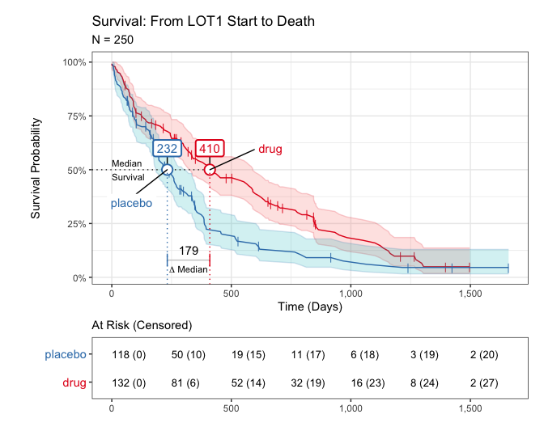
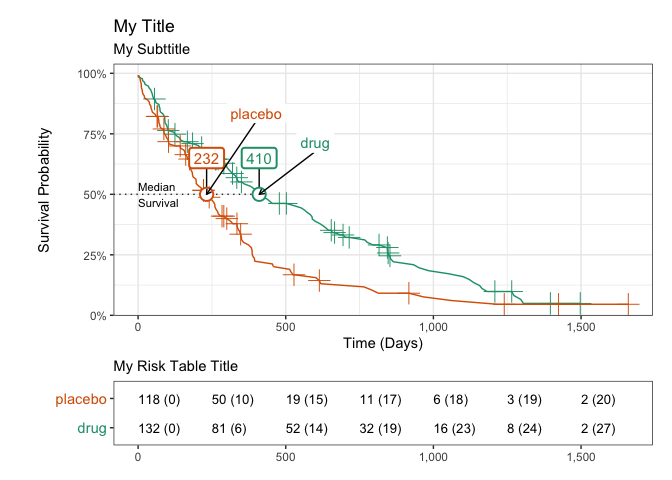

<!-- README.md is generated from README.Rmd. Please edit that file -->

# iwillsurvive 0.1.5 

<!-- badges: start -->

[](https://github.com/ndphillips/iwillsurvive/actions)
[](https://www.tidyverse.org/lifecycle/#experimental)
[](https://app.codecov.io/gh/ndphillips/iwillsurvive?branch=master)
[](https://en.wikipedia.org/wiki/Gloria_Gaynor)
<!-- badges: end -->

The goal of `iwillsurvive` is to make it easy to estimate and visualize
simple survival models. It does this by providing an intuitive
functional interface and user-friendly in-line messages, notes, and
warnings, while leveraging the gold-standard `survival` package for all
statistical methods.

## Installation

`iwillsurvive` is hosted at
<https://github.com/ndphillips/iwillsurvive>. Here is how to install it:

``` r
devtools::install_github(
  repo = "https://github.com/ndphillips/iwillsurvive",
  build_vignettes = TRUE
)
```

## Example

``` r
library(iwillsurvive)
library(dplyr)
```

I’ll now give a very brief overview of the basic survival model that
`iwillsurvive` works with. For a more thorough and informative
discussion, check out [Emily C. Zabor’s Survival Analysis in
R](https://www.emilyzabor.com/tutorials/survival_analysis_in_r_tutorial.html).
It’s awesome.

### Raw data

We’ll start with the `cohort_raw` dataset which represents the results
of a (fictional) clinical trial testing the effectiveness of a drug in
extending survival from a patient’s first line of therapy start date.

Here are the first 8 patients:

| patientid | sex |  age | condition | lotstartdate | lastvisitdate | dateofdeath |
|:----------|:----|-----:|:----------|:-------------|:--------------|:------------|
| F00001    | m   | 41.8 | placebo   | 2016-05-17   | 2020-12-01    | NA          |
| F00002    | m   | 45.3 | placebo   | 2020-07-27   | 2020-08-25    | 2020-10-05  |
| F00003    | m   | 52.9 | drug      | 2016-04-14   | 2017-02-16    | 2017-03-13  |
| F00004    | m   | 48.4 | drug      | 2020-06-12   | 2020-11-25    | NA          |
| F00005    | f   | 54.4 | placebo   | 2019-03-20   | 2020-01-13    | 2020-02-21  |
| F00006    | f   | 50.7 | placebo   | 2017-04-02   | 2017-10-18    | 2017-11-19  |
| F00007    | f   | 47.6 | placebo   | 2018-01-26   | 2019-01-12    | 2019-02-17  |
| F00008    | f   | 42.7 | placebo   | 2015-07-02   | 2015-11-20    | 2015-12-23  |

Here’s what the key columns mean:

| Column          | Definition                                                                                                              |
|:----------------|:------------------------------------------------------------------------------------------------------------------------|
| `patientid`     | A character referring to an individual patient in the form “FXXXXX”                                                     |
| `condition`     | A character indicating which condition the patient was in, unique values are: placebo, drug                             |
| `lotstartdate`  | A date indicating when a patient started their first line of therapy after diagnosis (will be used as the *index date*) |
| `lastvisitdate` | A date indicating the last known date that a patient was alive (will be used as the *censor date*)                      |
| `dateofdeath`   | A date indicating the date of death of patients who died during the study period (will be used as the *event date*)     |

### Research Question

Below is our main research question:

> What is the difference in median survival from lot1start to death (or
> censor) for patients in the placebo versus drug condition?

### Survival data

Before we can estimate the survival model, we need to define some key
columns:

| Variable        | Definition                                                                                               |
|:----------------|:---------------------------------------------------------------------------------------------------------|
| `followup_date` | The date at which the event occurs (if known), otherwise the last date the patient was known to be alive |
| `followup_days` | The number of days from indexdate to `followupdate`                                                      |
| `eventstatus`   | A logical column indicating whether or not the patient died. TRUE = Yes, FALSE = No.                     |

To calculate these variables, we can use `iwillsurvive`’s *derive*
functions: Use the `derive_*()` functions to calculate key derived
columns:

- `followup_date`: `dateofdeath`, if known, and `censordate`, otherwise
- `followup_days`: Days from `index_date` (in our case, `lotstartdate`)
  to `followup_date`
- `event_status`: A logical column indicating whether or not the event
  (`dateofdeath`) is known.

``` r
cohort <- cohort_raw %>%
  derive_followup_date(
    event_date = "dateofdeath",
    censor_date = "lastvisitdate"
  ) %>%
  derive_followup_time(index_date = "lotstartdate") %>%
  derive_event_status(event_date = "dateofdeath")
```

Here’s how the new columns look for the first 8 patients:

| patientid | followup_date | followup_days | event_status |
|:----------|:--------------|--------------:|:-------------|
| F00001    | 2020-12-01    |    1659.93708 | FALSE        |
| F00002    | 2020-10-05    |      70.10455 | TRUE         |
| F00003    | 2017-03-13    |     333.35423 | TRUE         |
| F00004    | 2020-11-25    |     166.74057 | FALSE        |
| F00005    | 2020-02-21    |     338.18433 | TRUE         |
| F00006    | 2017-11-19    |     231.78657 | TRUE         |
| F00007    | 2019-02-17    |     387.86797 | TRUE         |
| F00008    | 2015-12-23    |     174.93504 | TRUE         |

### Fitting survival models

Use `iwillsurvive()` to fit the survival model. We’ll set the follow up
time to be `followup_days` and specify “condition” as a term (i.e.;
covariate) to be used in the model.

<!-- * Note: If we were using `survival::survfit()` we'd need to specify this nasty  -->
<!-- looking formula `survival::survfit(survival::Surv(followup_days, event_status,  -->
<!-- type = 'right') ~ group, data = cohort)` ddirectly, With `iwillsurvive()`, we can  -->
<!-- simply specify the column names of interest and let the function take care of  -->
<!-- the formula -->

``` r
cohort_iws <- iwillsurvive(cohort,
  followup_time = "followup_days",
  terms = "condition",
  event_title = "Death",
  index_title = "LOT1 Start"
)
#> ── iwillsurvive ────────────────────────────────────────────────────────────────
#> - 202 of 250 (81%) patient(s) experienced the event.
#> - survival::survfit(survival::Surv(followup_days, event_status, type = 'right') ~ condition, data = data)
```

#### print method

Print the object to see summary information:

``` r
cohort_iws
```


#### Plotting followup times

Use `plot_followup()` to visualize the observed follow-up times for each
patient ordered by the length of their follow-up and colored by their
event status (not by condition)

``` r
plot_followup(cohort_iws)
```


#### Plotting Kaplan-Meier curves (the plot method)

Use `plot()` to plot the Kaplan-Meier survival curve. If you don’t
include any arguments, you’ll get the ‘default’ curve options.

``` r
plot(cohort_iws)
```



You can fully customize the look of your Kaplan-Meier curve (see
`?plot.iwillsurvive`) to see all the optional arguments:

``` r
plot(cohort_iws,
  add_confidence = FALSE,
  add_median_delta = FALSE,
  censor_pch = 3,
  censor_size = 5,
  legend_position_x = c(600, 400),
  legend_nudge_y = c(.25, .3),
  median_flag_nudge_y = .15,
  anchor_arrow = TRUE,
  palette = "Dark2",
  title = "My Title",
  subtitle = "My Subttitle",
  risk_table_title = "My Risk Table Title"
)
```



### Understanding iwillsurvive objects

The `iwillsurvive()` function returns an object of class `iwillsurvive`.
Internally, it is a list containing many objects from the original data,
to a `survival` object:

``` r
names(cohort_iws)
#>  [1] "data"                "fit"                 "fit_summary"        
#>  [4] "terms"               "event_title"         "index_title"        
#>  [7] "followup_time_col"   "followup_time_units" "timeatrisk_col"     
#> [10] "event_status_col"    "patientid_col"       "title"
```

The `.$data` object contains the original data

``` r
cohort_iws$data
#> # A tibble: 250 × 10
#>    patientid sex     age condition lotstartdate lastvisitdate dateofdeath
#>    <chr>     <chr> <dbl> <chr>     <date>       <date>        <date>     
#>  1 F00001    m      41.8 placebo   2016-05-17   2020-12-01    NA         
#>  2 F00002    m      45.3 placebo   2020-07-27   2020-08-25    2020-10-05 
#>  3 F00003    m      52.9 drug      2016-04-14   2017-02-16    2017-03-13 
#>  4 F00004    m      48.4 drug      2020-06-12   2020-11-25    NA         
#>  5 F00005    f      54.4 placebo   2019-03-20   2020-01-13    2020-02-21 
#>  6 F00006    f      50.7 placebo   2017-04-02   2017-10-18    2017-11-19 
#>  7 F00007    f      47.6 placebo   2018-01-26   2019-01-12    2019-02-17 
#>  8 F00008    f      42.7 placebo   2015-07-02   2015-11-20    2015-12-23 
#>  9 F00009    m      48.1 drug      2019-03-08   2020-07-18    2020-08-17 
#> 10 F00010    m      28.9 placebo   2018-08-23   2019-02-14    2019-03-08 
#> # ℹ 240 more rows
#> # ℹ 3 more variables: followup_date <date>, followup_days <dbl>,
#> #   event_status <lgl>
```

The `.$fit` object contains the `survival` object (created using the
`survival::survfit()` function)

``` r
cohort_iws$fit
#> Call: survfit(formula = survival::Surv(followup_days, event_status, 
#>     type = "right") ~ condition, data = data)
#> 
#>                     n events median 0.95LCL 0.95UCL
#> condition=drug    132    105    410     329     590
#> condition=placebo 118     97    232     184     313
```

The `.$fit_summary` object contains summary information:

``` r
cohort_iws$fit_summary
#> # A tibble: 2 × 10
#>   strata         records n.max n.start events rmean `se(rmean)` median `0.95LCL`
#>   <chr>            <dbl> <dbl>   <dbl>  <dbl> <dbl>       <dbl>  <dbl>     <dbl>
#> 1 condition=drug     132   132     132    105  542.        40.9   410.      329.
#> 2 condition=pla…     118   118     118     97  349.        39.4   232.      184.
#> # ℹ 1 more variable: `0.95UCL` <dbl>
```

### iwillsurvive and the survival package

`iwillsurvive` uses the `survival` package under the hood for all model
estimation. For that reason, you should always be able to get the ‘same
result’ using the `survival` package as you would using the
`iwillsurvive` package.

For example, here’s how to directly replicate the same result we got
using `survival`:

``` r
library(survival)

# Fit the model
fit_survival <- survival::survfit(
  survival::Surv(followup_days, event_status,
    type = "right"
  ) ~ condition,
  data = cohort
)

# Print method
fit_survival
#> Call: survfit(formula = survival::Surv(followup_days, event_status, 
#>     type = "right") ~ condition, data = cohort)
#> 
#>                     n events median 0.95LCL 0.95UCL
#> condition=drug    132    105    410     329     590
#> condition=placebo 118     97    232     184     313
```
